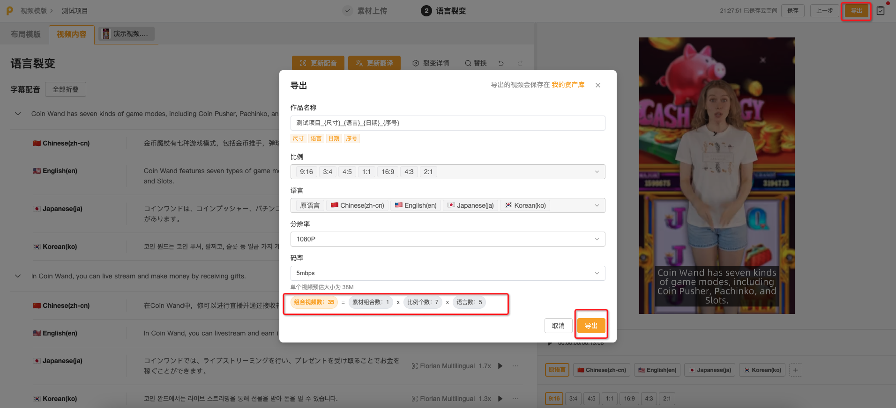
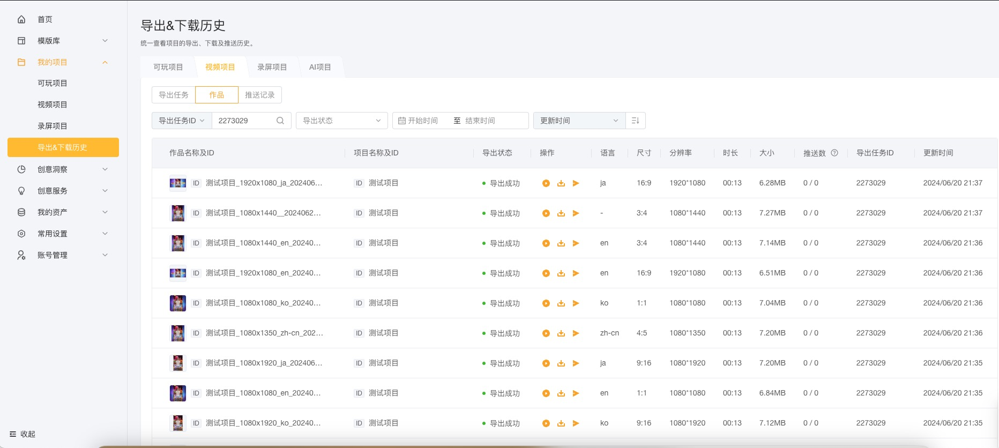

# 作品制作-创作指南

## 关于视频编辑器

Playturbo视频编辑器是一款专业的视频制作工具，旨在助您轻松完成视频创作。不论您是个人用户还是企业用户，Playturbo提供了丰富的功能，旨在满足您的各种创意和营销需求。

通过素材组合裂变、尺寸裂变和语言裂变功能，您可以批量制作多个版本的视频，并一次性批量导出及下载。

平台附带多项AI功能，助您高效创作。如AI自动识别视频中的对话内容并翻译成目标语言；同时支持视频智能配音及语音克隆实现人声分离；此外更有视频画面消除；智能镜头识别；自动翻译及文本编辑等功能。

此外，我们提供覆盖各类行业和场景的大量精美视频模板和素材资源，满足您不同的制作需求。

## <mark style="color:blue;">第一步：开始制作</mark>

### 1.从视频模版开始

Playturbo提供丰富的视频模板（模板数量持续增加中），满足不同行业和不同场景的创意制作需求。您可以在视频模板库中选择合适的模板，并创建视频编辑项目。

<figure><figcaption></figcaption></figure>

### 2.从空白画布开始

如果您希望从空白画布开始编辑，空白制作入口：**我的项目>>>视频项目** 列表中，新建视频编辑项目。

## <mark style="color:blue;">第二步：创意制作</mark>

完成项目创建后，进入创意制作环节。_视频编辑器操作可查阅：_[视频编辑器-使用指南](https://playturbo-doc.mindworks-creative.com/shi-pin-gong-ju-shi-pin-bian-ji-qi/shi-pin-bian-ji-qi-shi-yong-zhi-nan)

<figure><figcaption></figcaption></figure>

## <mark style="color:blue;">第三步：尺寸裂变</mark>

完成视频创意制作后，可通过以下俩种方式快速完成尺寸拓展，并一次性批量导出尺寸版本的视频创意。&#x20;

### 1.使用布局模版 （详细信息可查阅[布局模版](../shi-pin-gong-ju-kuai-su-ti-huan/kuai-su-ti-huan-shi-yong-zhi-nan/su-cai-shang-chuan-han-chi-cun-lie-bian/te-bie-jie-shao-bu-ju-mo-ban.md)）

* 选择合适的布局模板，选择需要添加裂变的展示比例并创建项目，上传并替换模板中的素材。系统将根据布局模板的样式自动完成多个尺寸的调整，以适应不同的显示设备或平台需求。

<figure><figcaption></figcaption></figure>

* 点击「从本地上传」或「从库里添加」上传素材，**并删除原模板自带素材**即可完成素材替换。

<figure><figcaption></figcaption></figure>

### 2.手动微调

* 如果您希望自定义所有尺寸下的元素布局，可以选择不使用布局模板，手动对各尺寸进行微调。
* 利用「**尺寸联动编辑**」功能，可批量调整相同元素在不同尺寸下的大小和位置，从而提升编辑效率。
* 只需在已添加的尺寸上悬停后点击「锁定」按钮即可激活「尺寸联动编辑」功能。取消「锁定」后，该尺寸将不再与其他尺寸编辑进行联动。

<figure><figcaption></figcaption></figure>

## <mark style="color:blue;">第四步：语言裂变</mark>

当需要将制作好的视频用于不同国家地区时，可通过语言裂变功能快速完成视频项目翻译，并一次性批量导出多个语言版本的视频。

首次进入【语言裂变】页面时，需要选择待翻译的内容。 可选内容范围包括：

* 布局模板：在「尺寸裂变」使用的布局模版中需要翻译的文本内容，如按钮文本、产品名称、推广文案等。项目未使用布局模版的话，此处内容为空。&#x20;
* 视频内容： 在「创意制作」环节添加已上传的字幕&配音、文本、图片和视频。&#x20;

<figure><figcaption></figcaption></figure>

<mark style="color:red;">您可以在顶部的「</mark><mark style="color:red;">**语言裂变**</mark><mark style="color:red;">」中再次修改需要翻译的内容范围。</mark>

### 1.布局模版翻译

* 在【布局模版】界面中，您可以对布局模版中已添加的的文本（如按钮文本、产品名称、推广文案等）进行翻译。
* 激活文本框后，您可以使用AI工具进行文本处理，包括缩写、扩写、改写和重新翻译。
* 点击文本后，右侧的视频预览区域会自动定位到该文本出现的起始时间进行播放。

<figure><figcaption></figcaption></figure>

### 2.视频内容（创意制作）翻译

在【视频内容】界面中，可以对在「创意制作」添加的字幕&配音、文本、图片和视频进行翻译。

<figure><figcaption></figcaption></figure>

#### 2.1文本&文本资产组：

对创意制作环节添加的文本或文本资产组内文本进行翻译。

#### 2.2字幕&配音：

1）**字幕**：

* 系统自动识别视频中对话角色（说话人）和对话内容（字幕），并翻译字幕翻译到指定语言。您可以在系统识别基础上修改说话人、字幕内容和字幕翻译结果。
* 选中原语言字幕后，您可以进行字幕分割、合并、删除、新增操作。
* 如果修改了原语音字幕，可通过点击顶部**「**更新翻译**」**，批量更新其它语言翻译结果。&#x20;

<figure><figcaption></figcaption></figure>

2）**配音**：

* 按照说话人进行配音音色选择。可以使用系统预设的音色（文本转语音）朗读字幕翻译结果，也可以使用原视频音色（语音克隆/语音转语音）朗读。&#x20;
* 为了确保视频翻译后语音与视频画面同步，翻译语言的配音会自动变速，以适配原语言字幕的时长。过慢或过快的异常变速会影响视频播放效果，您可以通过修改字幕翻译文本长度来更新配音。
* **如果修改了字幕内容、说话人或说话人音色，可通过点击顶部「更新配音」，批量更新其它语言的配音结果**。&#x20;

<figure><figcaption></figcaption></figure>

<mark style="color:red;">注意：如果项目原语言下只有手动添加的字幕，而不是通过对视频进行语音识别获得的字幕。这种情况下，由于原语言缺少可复制的原声，无法使用语音克隆（语音转语音）功能去朗读字幕翻译结果。</mark>&#x20;

#### 2.3图片&视频

在创意制作环节添加的图片或视频，可以按照语言维度进行素材组合。例如，如果视频中使用了USD标识图片，希望在中文下使用CNY标识图片，在日文下使用JPY标识图片。您可以选择创意项目中的USD标识图片，在中文和日文下分别上传对应的币种标识图片。

## <mark style="color:blue;">第五步：预览及导出</mark>

* 完成视频编辑工作后，点击导航栏「导出」，进行导出设置，根据视频用途选择适当的分辨率和码率。
* 可批量导出的视频数量=「创意制作」页添加的素材组合数×「尺寸裂变」页添加的比例数×「语言裂变」页添加的语言数。&#x20;
* 导出任务提交后，您可以在菜单栏【**我的项目-导出&下载历史】**列表中查看历史任务进展。&#x20;

<figure><figcaption></figcaption></figure>

<figure><figcaption></figcaption></figure>

<mark style="color:red;">**导出完成的视频可下载到本地，或直接推送到已授权的广告渠道账号。**</mark>
